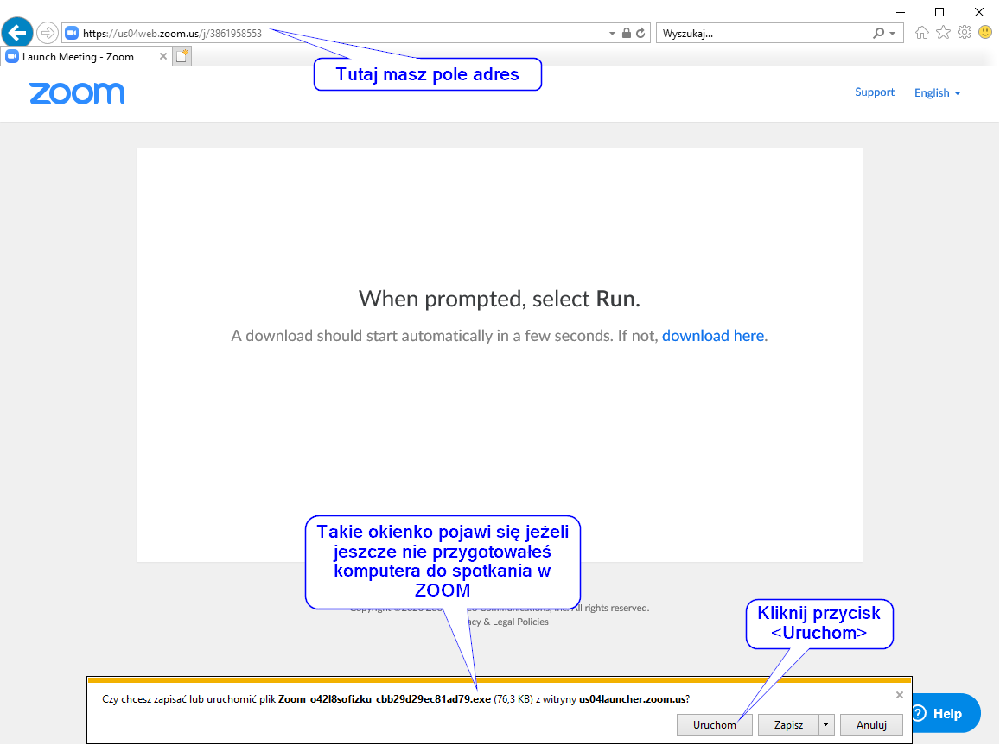
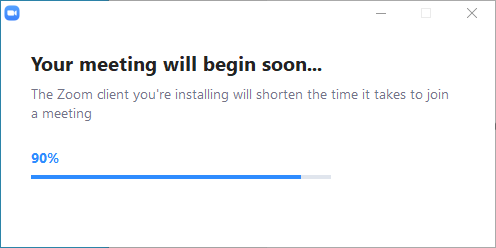
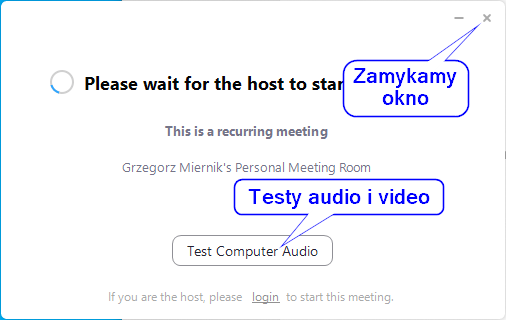
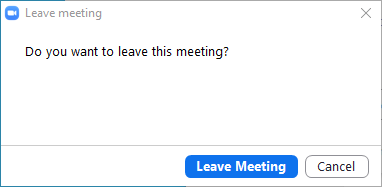
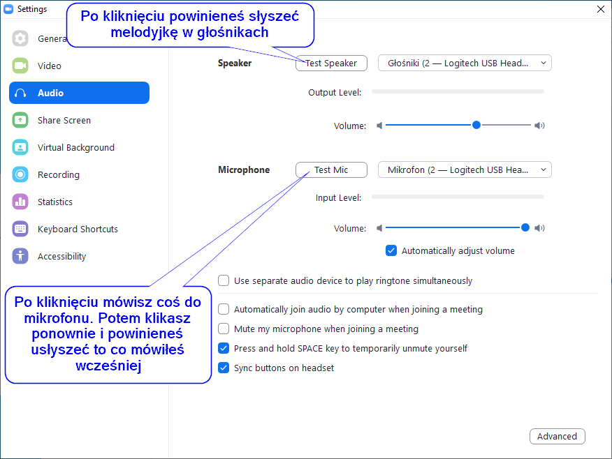
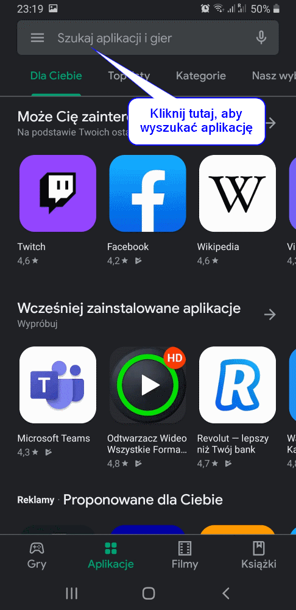
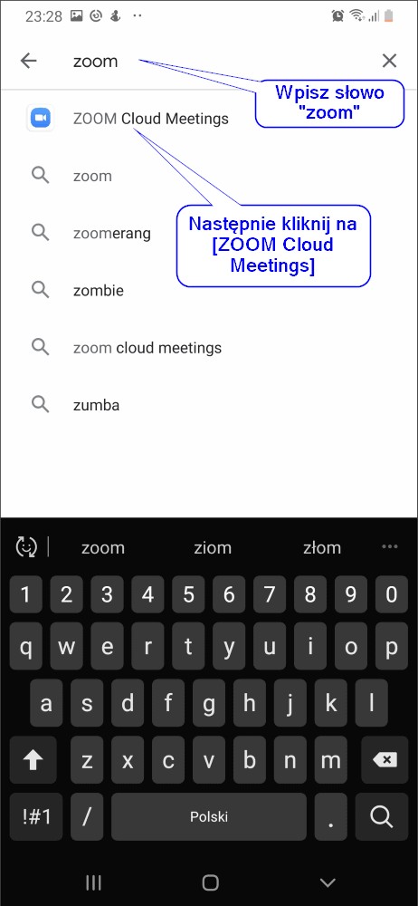
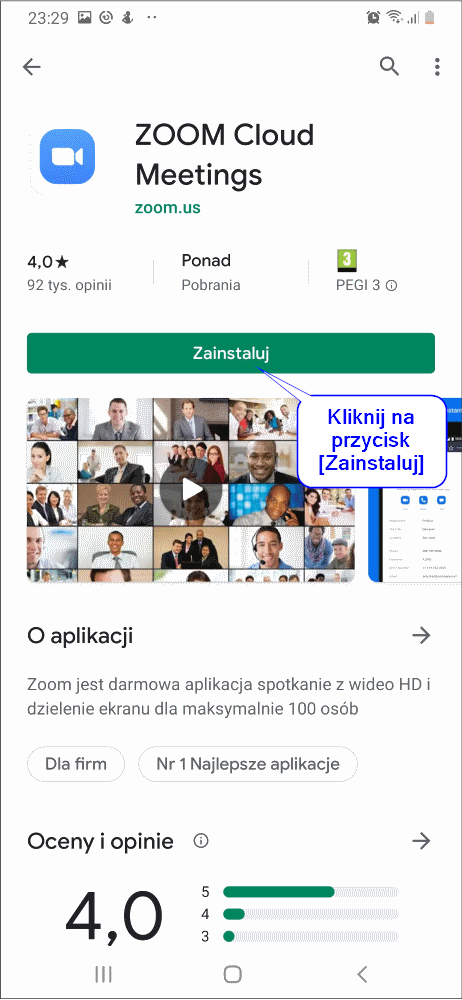
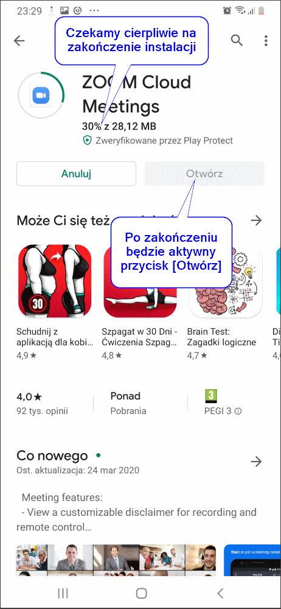
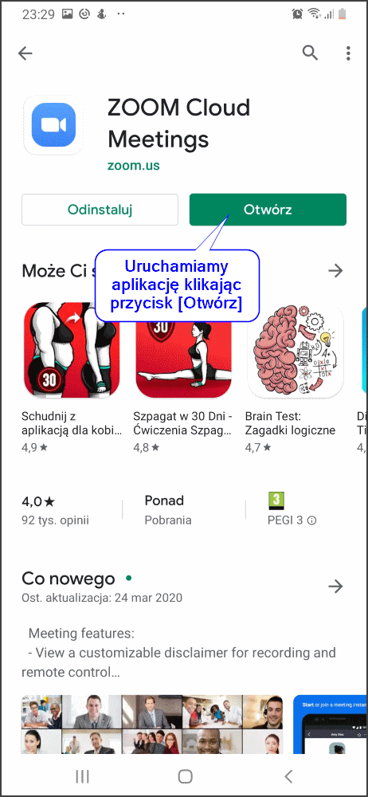

# Przygotowanie komputera do spotkania w „ZOOM”

## Spis treści

[TOC]

## Co to jest ZOOM?

Jeżeli słyszałeś kiedyś o Skype, Whatsapp lub Webex to jest to podobne rozwiązanie umożliwiające połączenie audio i video przez Internet. Jeżeli nie słyszałeś to się tym nie przejmuj. Najważniejsze informacje znajdziesz w poniższej instrukcji.

 

## Wymagania początkowe

Jeżeli posiadasz KOMPUTER z systemem Windows 7 lub nowszy to wystarczy. Może być również Windows XP lub Vista, ale wtedy wymaga dodatkowych aktualizacji, których możesz nie mieć – proszę o kontakt bezpośredni. Oczywiście komputer musisz mieć podłączony do Internetu i wyposażony w mikrofon oraz kamerę. Jeżeli nie posiadasz mikrofonu i kamery to możesz podłączyć się do spotkania, ale bez możliwości przekazania swojego głosu oraz obrazu.

Jeśli nie masz komputera, ale masz telefon tzw. smartfon – taki bez klawiszy, z dużym kolorowym ekranem to również wystarczy.

 

## Przygotowanie komputera

Zakładam, że masz system Windows 7 lub nowszy. Jeśli nie to skontaktuj się bezpośrednio to Ci pomogę przygotować komputer.

1. Uruchom komputer i otwórz przeglądarkę Internetową. Na przykład „Internet Explorer”.

2. W polu adres wpisz: <https://us04web.zoom.us/j/3861958553> - nie lękaj się, to jest adres do prywatnego spotkania, który wykorzystamy tylko do przygotowania komputera. Zobaczysz podobny ekran jak poniżej.

 

 

3. Następnie pojawi się przez chwilkę okno instalacji programu ZOOM umożliwiającego podłączenie się do spotkania. Nie przejmuj się obcym językiem. Po prostu poczekaj aż niebieski pasek przejdzie do 100%. Nic nie rób, może to potrwać chwilę zależnie od twojego komputera.

 

4. Jeżeli widzisz poniższe okno to znaczy, że jesteś gotowy do spotkania. Proponuję jednak, abyś zweryfikował sobie prawidłowe działanie głośników, mikrofonu i kamery. Szczegóły w kolejnych punktach. Poniższy ekran informuje, że musisz zaczekać na organizatora spotkania. Jeżeli podczas Twoich prób nie będę mógł się podłączyć, to się nie przejmuj. Komputer jest gotowy do podłączenia. Teraz możesz czekać na adres spotkania

 

Zalecam weryfikację podłączonych głośników i mikrofonu. Jeżeli nie chcesz tego robić teraz to zamykasz okno i pojawi się poniższy komunikat. Wtedy klikasz niebieski przycisk <Leave Meeting>.

 

5. Po kliknięciu na przycisk <Test Computer Audio> możesz zweryfikować działanie głośnika i mikrofonu. Najpierw sprawdź czy słyszysz przykładową melodyjkę w głośnikach. Następnie zweryfikuj działanie twojego mikrofonu. Więcej szczegółów na poniższym ekranie.

## Przygotowanie telefonu (Android)

Dla posiadaczy telefonów innych niż iPhone firmy Apple przygotowałem instrukcję jak przygotować telefon do podłączenia się do spotkania w ZOOM. Jeżeli jesteś posiadaczem iPhone to podobnie instalujesz program, ale ekrany mogą wyglądać nieco inaczej.

1. Rozpoczynamy od uruchomienia aplikacji [Sklep Play]. Poniżej masz przedstawioną ikonkę aplikacji, którą powinieneś znaleźć u siebie na telefonie.

   

2. Następnie wyszukujemy aplikację, która umożliwi nam podłączenie się do spotkania. Po uruchomieniu aplikacji [Sklep Play] zobaczymy podobne okno, w który na górze możemy wpisać słowo kluczowe "zoom".

   

   

   Następnie wpisujemy słowo [zoom] i wybieramy z listy aplikację [ZOOM Cloud Meetings]. Patrz poniżej na ekranie.

   

3. W tym kroku potwierdzamy chęć instalacji aplikacji poprzez kliknięcie na przycisku [Zainstaluj]. Jeżeli widzisz przyciski [Odinstaluj] i [Otwórz] to znaczy, że już zainstalowałeś ten program i możesz od razu przejść do kolejnego kroku.

   

   

   Następnie musimy nieco poczekać na zakończenie procesu instalacji. Będziemy widzieli poniższe okno z informację o postępie instalacji. Czekamy do momentu, kiedy będziemy mieć aktywny przycisk [Otwórz].

   

   

4. Uruchamiamy aplikację [ZOOM Cloud Meetings] klikając na przycisk [Otwórz].

   

   W efekcie zobaczymy poniższy ekran, z którego możemy podłączyć się już do spotkania. Kolejne kroki jak podłączyć się do spotkania znajdziesz następnym rozdziale.

## Jak podłączyć się do spotkania?

Będzie opracowane w wkrótce ...